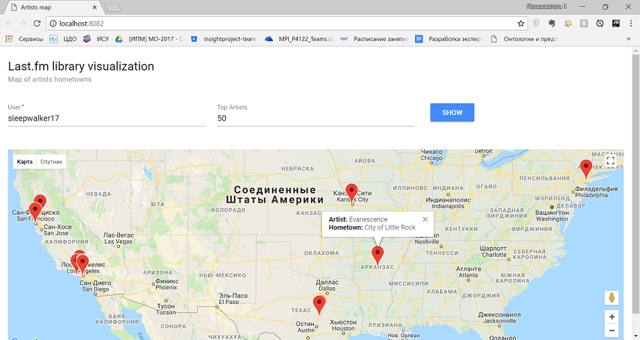

# Last.fm library visualization project

> If you want to know where your favourite artists are from, use this project.
Enter any last.fm user name and how many artists should be represented on the map.

### Technologies

This project is built with [spring boot](https://spring.io/projects/spring-boot) and [vue.js](https://vuejs.org/).

[Vue-google-maps](https://www.npmjs.com/package/vue2-google-maps) is used for map visualization.

[Vue-material](https://www.npmjs.com/package/vue-material) is used to create beautiful design.

Data sources: SPARQL-endpoint of [dbpedia.org](https://wiki.dbpedia.org/) and [last.fm](http://www.last.fm/) REST API.

### Screenshots

[Screencast video](https://www.youtube.com/watch?v=JCGxFa0msCY)
